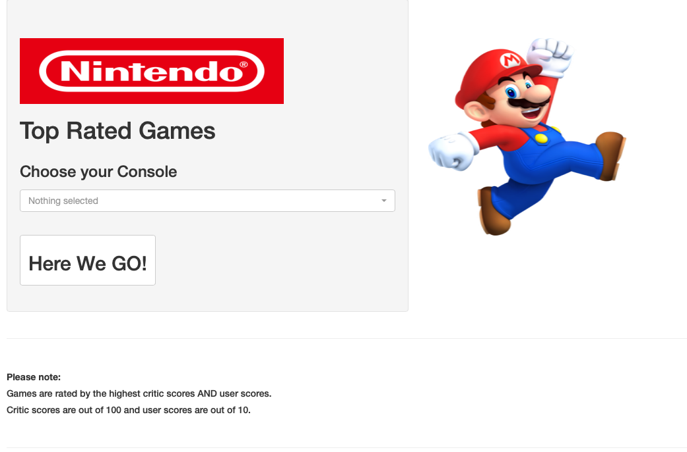
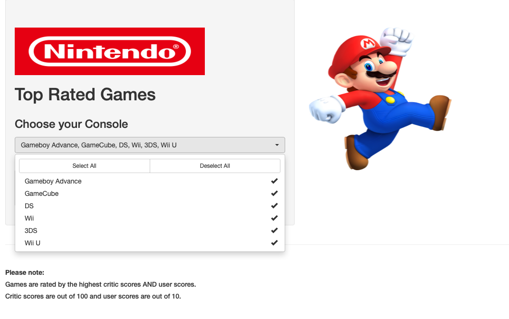

# Nintendo App

### Hello and welcome to the README page for my Nintendo App.

#### App Bio

This app was created as part of a homework assignment, which I thoroughly enjoyed. The brief was to use a dataset that contained the details of thousands of games across many different platforms. I decided to focus on Nintendo as I am particularly fond of Nintendo games.

The app itself is very straightforward and allows the user to select either an individual console, or several, (*see image below*) which then displays the top rated games. Rating is based on both critic scores and user scores accordingly, to allow for a broader range.

Probably my favourite part of the app is that when you click on the 'here we go' button, to load the results, I have included a Nintendo sound effect play!

  
